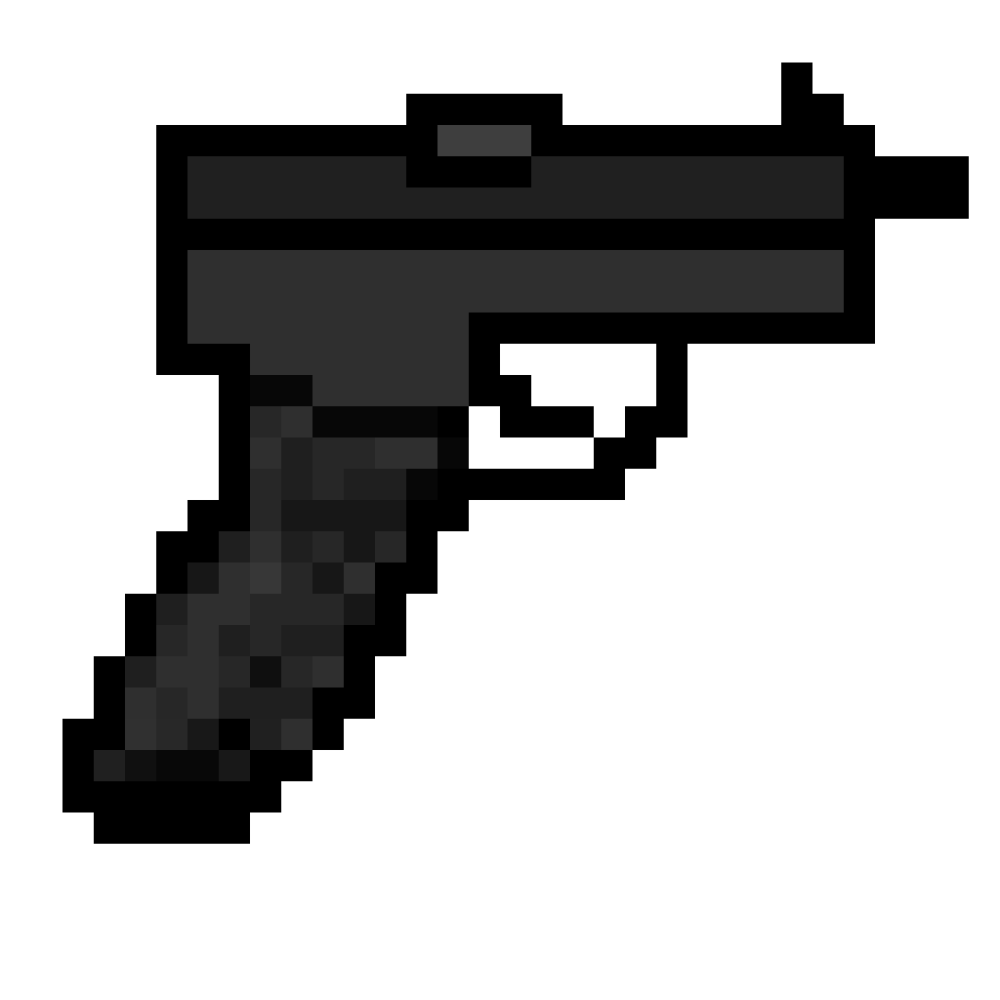

<h1 align="center">AguaDeCoco</h1>

I'm a discord.js bot developer. I love JavaScript

<h3 align="center">If you want to contact me, <a href="https://discord.gg/AmUM4EVs">join to my discord</a></h3>

  <code><b>Donations</b></code>  
    
  <code><b>My proyects</b></code>  
  
  
    
  <b>
    I'm working in <a href="https://top.gg/bot/813152173818904597">MichiBot</a> and <a>LatinConomy</a>
  </b>
    

<table align="center">
  <tr>
    <td>
      
      
    </td>
  </tr>
</table>
